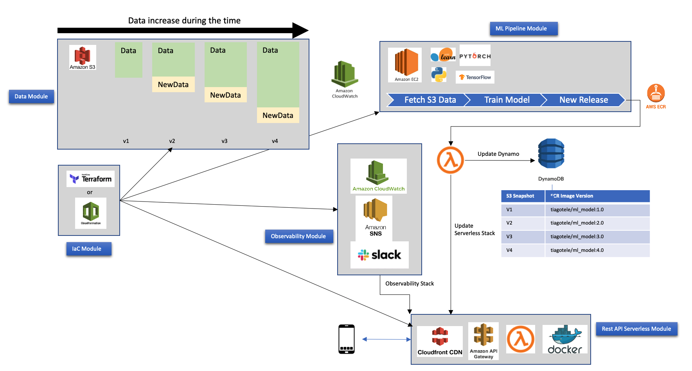

# Sample REST API with ML

This repo runs a ML model on REST api using FastAPI.
The model used the iris dataset and was trained with KNN algorithm, where n = 3.
Next sessions show details about how to build/run.

## How to Run
```
./pipeline.sh
```

## Building docker image
```
docker build -t tiagotele/my_ml_model:1.0 .
```

## Running docker image available on DockerHub.
```
docker run  --name my_ml_app -p 8000:8000 -t tiagotele/my_ml_model:1.0
```

## Pushing to DockerHub
```
docker login 
docker push tiagotele/my_ml_model:1.0
```

## Docker image
Docker image are available at [DockerHub](https://hub.docker.com/repository/docker/tiagotele/my_ml_model).

## AWS Architecture



The above image represents and initial AWS Architecture for this ML Rest service.

There is four main blocks on gray background. They have its own purpose.

### IaC Module
The infrastructre as a code module is in charge of build the whole infrastructure and AWS components. It can be done with Terraform or AWS Cloudformation.

### Data Module
Is a S3 datalake. This data is periodically versioned(can be a folder inside the same bucket but with the most updated data) and treated as a single dataset.

### The pipeline Module
This modules is done by a EC2 Spot instance to save cost. A custom EC2 image will be build with needed packages/softwares to fetch data from S3, train a new ML model, build a new Docker image and deploy this image into a AWS Elastic Container Registry(ECR). After this new image is pushed to ECR, a AWS Lambda function will update a Dynamo table that has as key/value the S3 dataset version and ECR image version. 

### The REST Api Serverless Module
This is a REST API build on AWS Serverless stack. The AWS Cloudfron will be on edge and delivery and API Gateway that send its data api calls to AWS Lambda. This Lambda will run a Docker image existing on ECR.

### Observability Stack
Some metrics and rules will be created to continuously monitor the REST API. In case of trouble it will call AWS SNS to notify operations team on Slack Channel.

### Pros and Cons of the architecture

This architecture aims to be a low cost ML Data Pipeline. It has a general purpose and is a cost effective. For performance requirements and more robust ML Models, as using Neural Nets, using a SageMaker pipeline to automate trainning and daploy would be more properly. It may incurs bigger costs.